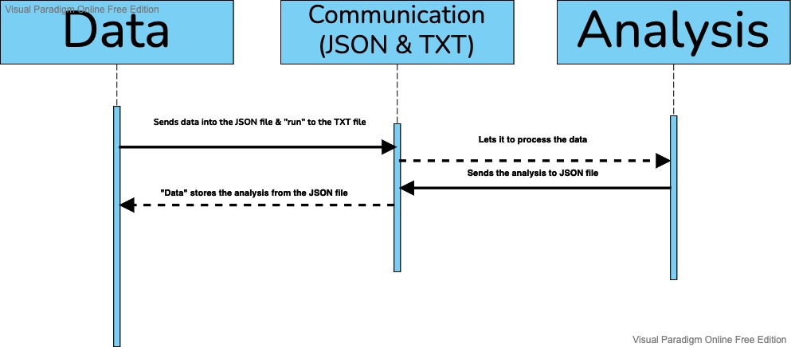

# (CCA) Component-Counter-Analysis

### CCA is a microservice to analyze the data's components count.
It takes the data as a string, analyze it, then returns a dictionary consisting of 'characters', 'words', and 'paragraphs' counts.
Also, it can take two CCAs (analyzed data) and returns a CCA comparison analysis as a string.


Communication is done through JSON & TXT files.

The program has to send the data to the JSON file & be the only data in it.
Sending either the data as a string, or two CCAs within a dictionary of the keys '1' & '2'.
Then, send "run" to the TXT file, and let the program pause/sleep for ~5s.

The CCA will analyze it, then send the data to the JSON file.
Then, the program can store the analysis from the JSON file.


Sample (Python):
```
import time, json

open('CCAc.json', 'w').close()
with open('CCAc.json', 'w') as request:
    json.dump(string1, request)
with open('comm.txt', 'w') as comm:
    comm.write("run")
time.sleep(5)
with open('CCAc.json', 'r') as response:
    analysis1 = json.load(response)

open('CCAc.json', 'w').close()
with open('CCAc.json', 'w') as request:
    json.dump(string2, request)
with open('comm.txt', 'w') as comm:
    comm.write("run")
time.sleep(5)
with open('CCAc.json', 'r') as response:
    analysis2 = json.load(response)

cmpr = {
    1: data1,
    2: data2
}
open('CCAc.json', 'w').close()
with open('CCAc.json', 'w') as request:
    json.dump(cmpr, request)
with open('comm.txt', 'w') as comm:
    comm.write("run")
time.sleep(5)
with open('CCAc.json', 'r') as response:
    analysis3 = json.load(response)
```

## UMLSD
